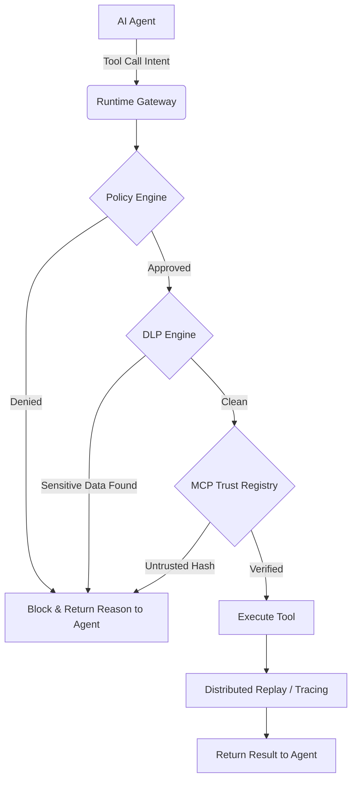

# System Architecture

The **Agent Runtime Security Platform** is built on a highly modular, event-driven architecture designed to govern and secure autonomous AI agent operations at runtime. 

## High-Level Overview

At its core, the system acts as an intelligent proxy/middleware between your AI Agents (LangChain, AutoGen, custom implementations) and the external world (APIs, Databases, local filesystem). 

Every action or "tool call" an agent attempts to make is routed through our evaluation engines before execution.

## Core Engines

### 1. Runtime Policy Engine

The Policy Engine evaluates agent intents against defined rulesets.
- **Dynamic Rules:** Policies can be context-aware (e.g., block refunds > $100 unless manager approved).
- **Conflict Resolution:** Handles overlapping rules to ensure the most restrictive security posture applies.
- **Modes:** Support for `BLOCK`, `WARN`, and `AUDIT` modes.

### 2. Data Loss Prevention (DLP)

The DLP Engine acts as a real-time scanner on both outgoing payloads and incoming responses.
- **Pattern Matching:** Scans for PII (Credit Cards, Social Security Numbers) and Credentials (AWS keys, API tokens).
- **Redaction:** Can automatically redact sensitive strings before the payload leaves the network.

### 3. MCP Trust Registry

Model Context Protocol (MCP) introduces new supply-chain risks. The Trust Registry mitigates this.
- **Cryptographic Hashing:** Verifies the SHA-256 hash of external tools.
- **Approved Lists:** Blocks execution if an agent attempts to load an untrusted or newly modified tool without explicit authorization.

### 4. Distributed Multi-Agent Replay

An OpenTelemetry-inspired tracing system purpose-built for multi-agent swarms.
- **Trace Linkage:** Connects parent agent actions to child agent spawns.
- **Immutable Log:** Stores a complete, immutable timeline of decisions, tool calls, and contexts for post-incident forensics.
- **Replayability:** Allows developers to step through a swarm's thought process frame-by-frame.

## Monorepo Structure (Turborepo)

- `security-core/`: The backend service running the above engines (NestJS, Prisma, PostgreSQL).
- `packages/ts-sdk/`: TypeScript client for agents to interface with the Gateway.
- `packages/python-sdk/`: Python client for agents to interface with the Gateway.
- `examples/`: Reference implementations and demos.
